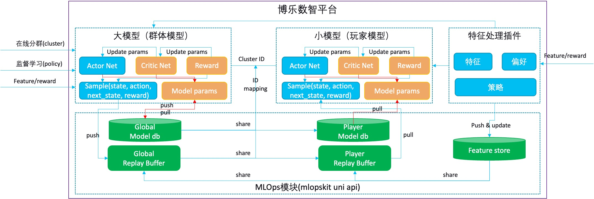

<h1 align="center"><a href="https://github.com/AlgoLink/minirl">minirl</a></h1>

  <em>基于Numpy的深度强化学习</em>

---

这个 repo 包含一组从头开始使用 numpy 实现的用于强化学习的应用程序和算法。包括的算法q-learning、基于深度神经网络的REINFORCE和 Actor-Critic。

## 项目结构

    .
    ├── core
        ├── pg.py                   # REINFORCE algorithm
        ├── deep_q_learning.py      # Deep Neural Network based Q-learning
        ├── ac.py                   # Actor-Critic algorithm
    ├── common                      
        ├── net.py                  # Common-deep-network
        ├── optim.py                # Optimizer        
    └── README.md

## 技术架构

